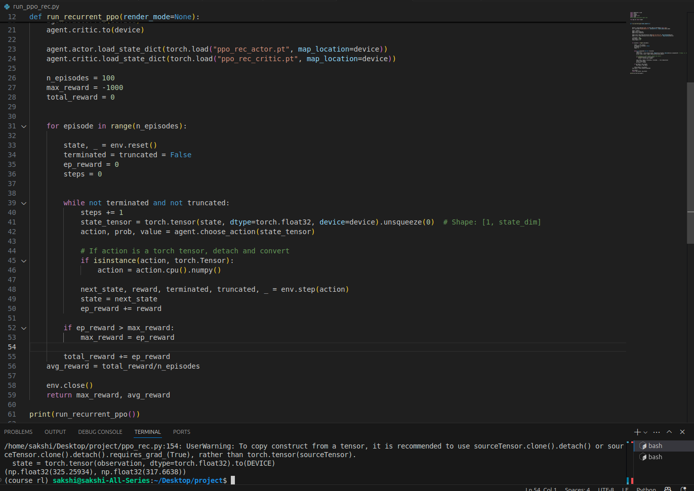

# Solving the Bipedal-Walker Gym environment.
## As shown in the image below, the algorithm achieves an average of 300+ rewards in 100 episodes, the required criteria for "solving" the environment.

  

